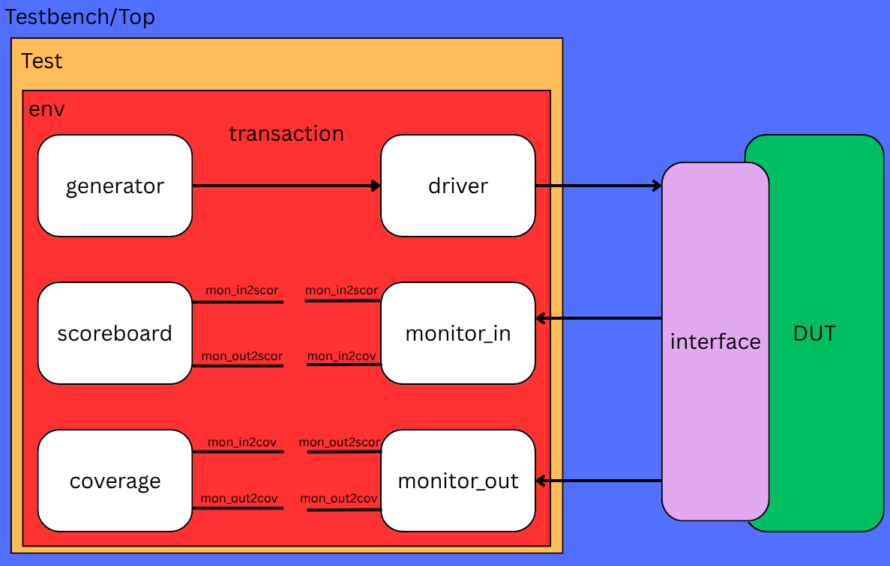
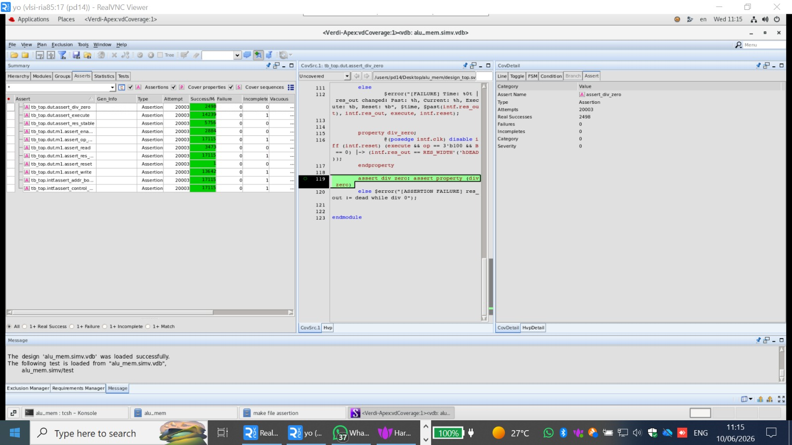
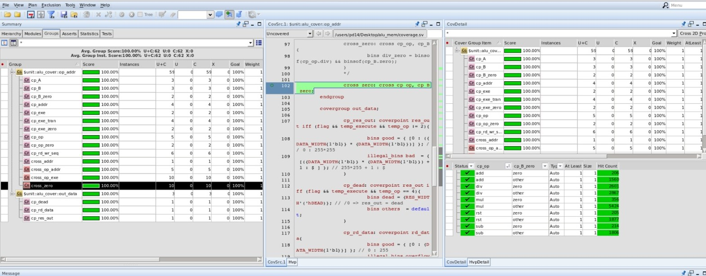

# SystemVerilog ALU-Memory Verification Project

## 📌 Overview
This repository contains a comprehensive, **Object-Oriented Programming (OOP)** based SystemVerilog Verification Environment for an ALU-Memory Subsystem. The project demonstrates advanced Pre-Silicon verification methodologies, including **Constrained Random Verification (CRV)**, **Assertion-Based Verification (ABV)**, and **Functional Coverage** analysis to ensure hardware integrity.

---

## 🛠️ Design Under Test (DUT)
The `alu_mem` module integrates an ALU and a Register Bank.
* **ALU:** Arithmetic operations (ADD, SUB, MUL, DIV).
* **Memory Unit:** Operands (A, B), Opcode, and Execution trigger.
* **Interface:** Modular `alu_mem_if` with modports and clocking blocks.

*Figure: Technical specification of the ALU-Memory Subsystem.*

---

## 🏗️ Verification Environment Architecture
The environment follows a layered, modular architecture:
* **Generator:** Randomized transactions with constraints (e.g., div_zero_tran).
* **Driver:** Stimulus injection into the virtual interface.
* **Monitors:** Independent `monitor_in` and `monitor_out` for precise tracking.
* **Scoreboard:** Real-time self-checking via Mailboxes.

*Figure: Layered Verification Environment Architecture.*

---

## 🛡️ Assertion-Based Verification (ABV)
We implemented Concurrent Assertions (SVA) to monitor:
* **Protocol Checks:** Handshake and timing enforcement (`|->`, `|=>`).
* **Arithmetic Integrity:** Division-by-zero validation (`0xDEAD`).
* **Stability:** Register bank reserved bits and idle output stability.

*Figure: Assertion-based verification pass/fail status.*

---

## 📈 Coverage-Driven Verification (CDV)
Verification quality is measured through:
* **Code Coverage:** Statement, branch, and toggle coverage.
* **Functional Coverage:** Opcode coverage, cross-coverage, and bins analysis.

*Figure: Functional and Code coverage metrics summary.*

---

## 📊 Simulation Results
1. **Automated Verification:** Zero mismatches recorded in the Scoreboard.
2. **Waveform Debugging:** Verdi analysis confirms signal timing and logic validity.

*Figure: Waveform analysis demonstrating synchronous data transfer.*

---

## 🚀 Key Features
* **CRV:** Maximizes test space exploration.
* **OOP Implementation:** Inheritance and polymorphism.
* **Coverage-Driven Closure:** Metric-based completion.

---

## 💻 Tools
* **Simulation:** Synopsys VCS
* **Analysis:** Verdi GUI (Waveforms, Coverage Reports)
