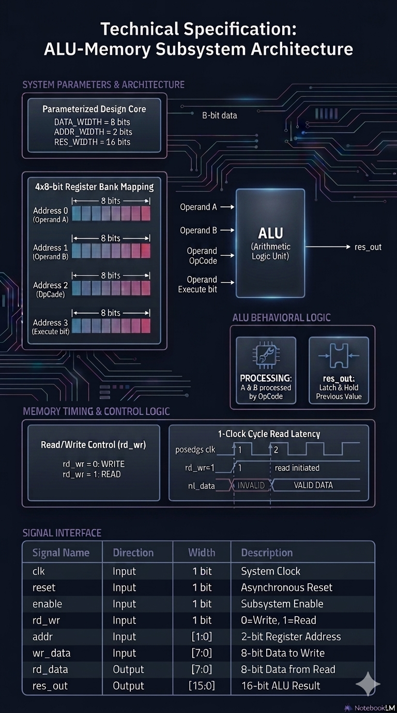
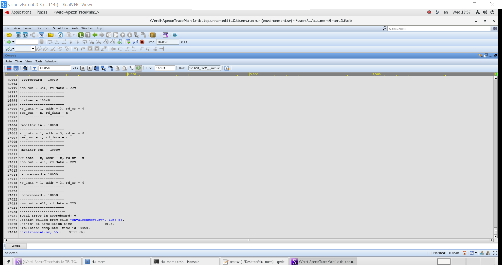

# SystemVerilog ALU-Memory Verification Project

## 📌 Overview
This repository contains a comprehensive, **Object-Oriented Programming (OOP)** based SystemVerilog Verification Environment for an ALU-Memory Subsystem. The project demonstrates advanced Pre-Silicon verification methodologies, including **Constrained Random Verification (CRV)** and automated self-checking architectures, to ensure the functional integrity of the hardware design.

---

## 🛠️ Design Under Test (DUT)
The DUT is a unified module (`alu_mem`) consisting of:
* **ALU:** Supports parameterized arithmetic and logic operations.
* **Memory Unit:** Includes internal registers for operands (A, B), operation codes (op), and execution triggers.
* **Interface:** A modular `alu_mem_if` connecting the testbench and design via specialized **modports** and **clocking blocks** to ensure synchronous data sampling and prevent race conditions.

*Figure: Technical specification and 1-clock cycle read latency timing diagram of the ALU-Memory Subsystem.*

---

## 🏗️ Verification Environment Architecture
The testbench follows a modern **Layered Architecture** to promote modularity and reusability:

* **Generator:** Creates randomized stimulus transactions, including constrained sequences for corner cases like *Division by Zero* and *Arithmetic Overflow*.
* **Driver:** Receives transactions from the generator and injects them into the virtual interface.
* **Monitors:** Split into `monitor_in` (sampling inputs post-driver) and `monitor_out` (sampling DUT execution results) for precise, independent data tracking.
* **Scoreboard:** Performs automated, real-time self-checking by predicting expected results and comparing them against actual DUT outputs using **Mailboxes** and **Queues**.
* **Environment & Test:** Encapsulate all verification components and manage simulation execution phases.

---

## 📊 Simulation & Verification Results

To validate the robustness of the ALU-Memory subsystem, extensive simulations were executed. The testbench successfully verified all transactions, driving and validating a wide range of constrained-random stimuli and complex corner-case scenarios.

### 1. Automated Verification (Scoreboard Output)
The simulation log below demonstrates the automated self-checking mechanism of the Scoreboard. Every generated transaction was monitored, compared against the reference model, and verified with zero mismatches.

*Figure 1: Synopsys VCS simulation log demonstrating successful test suite execution with fully matched transactions and zero errors.*

### 2. Waveform Analysis (Debug via Verdi)
The timing diagram captured during the simulation illustrates the synchronous data transfer across the virtual interface (`alu_mem_if`). 

*Figure 2: Waveform analysis in Verdi GUI demonstrating clocking block synchronization, modport enforcement, and race-condition-free data sampling between the testbench and the DUT.*

---

## 🚀 Key Features
* **Constrained Random Verification (CRV):** Leveraged to maximize functional coverage and stress corner-case scenarios.
* **OOP Implementation:** Full utilization of object-oriented principles, including inheritance (e.g., `good_tran` extending the base transaction class) and polymorphism.
* **Dynamic Data Handling:** Safe and synchronized data stream handling using SystemVerilog Mailboxes.
* **Advanced Debugging:** Seamless integration with industry-standard debugging tools.

---

## 💻 Tools & Simulation
The environment is simulator-agnostic but fully verified using industry-standard EDA tools:
* **Simulation:** Synopsys VCS 
* **Debugging:** Verdi GUI for advanced waveform analysis and signal tracing
