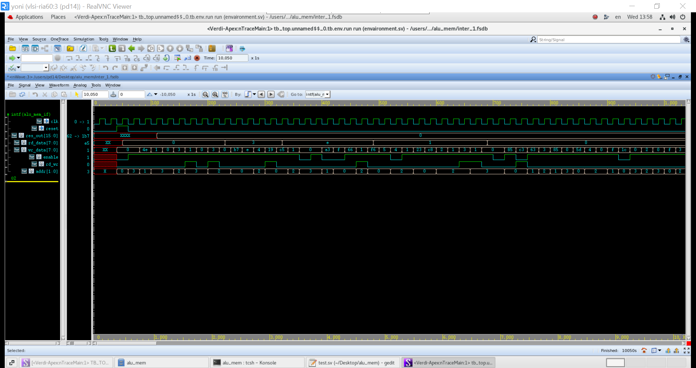

# SystemVerilog ALU & Register-Bank Verification Environment

## 📌 Overview
This project demonstrates the development of a complete Object-Oriented SystemVerilog verification environment for an ALU and Register-Bank subsystem. 
The verification environment was built from scratch using industry-standard verification concepts, including Constrained-Random Verification (CRV), SystemVerilog Assertions (SVA), Functional Coverage, Code Coverage, and self-checking mechanisms. 
The primary goal was to verify RTL functionality, identify design bugs, and achieve verification closure through coverage-driven methodologies.

---

## 🚀 Key Features

* Object-Oriented SystemVerilog Verification Environment
* Constrained-Random Verification (CRV)
* Assertion-Based Verification using SVA
* Functional and Code Coverage Closure
* Self-Checking Scoreboard Architecture
* Mailbox-Based Communication
* RTL Debug and Bug Discovery

 ---

 ## 💻 Tools

* SystemVerilog
* Synopsys VCS
* Synopsys Verdi

---

## 🛠️ Design Under Test (DUT)
The DUT consists of:
* **ALU:** Supports arithmetic operations: Addition (ADD), Subtraction (SUB), Multiplication (MUL), and Division (DIV).
* **Register Bank:** Stores Operand A, Operand B, Opcode, and the Execute control signal.

The ALU and Register Bank are integrated into a single subsystem that receives commands, executes operations, and generates results.

*Figure: Technical specification of the ALU-Memory Subsystem.*

---

## 🏗️ Verification Environment Architecture
A modular OOP-based verification environment was developed using SystemVerilog classes and Mailbox-based communication.

### Components
* **Generator:** Creates constrained-random and directed transactions. Supports specialized scenarios such as division-by-zero testing.
* **Driver:** Converts transactions into DUT stimulus and drives signals through the virtual interface.
* **Input Monitor:** Captures DUT inputs and sends observed transactions to the Scoreboard.
* **Output Monitor:** Captures DUT outputs and tracks actual DUT behavior.
* **Scoreboard:** Implements automatic result checking, compares expected and actual results, and reports mismatches or functional errors.
* **Coverage:** Collects functional coverage, tracking opcode combinations and corner cases.

Communication between components is implemented using SystemVerilog Mailboxes.

*Figure: Layered Verification Environment Architecture.*

---

## 🛡️ Verification Methodology

### Constrained-Random Verification (CRV)
The environment generates randomized transactions while enforcing legal DUT constraints. Verification included:
* **20,000+** constrained-random transactions.
* Directed corner-case scenarios.
* Error-injection testing & Division-by-zero validation.

This approach maximized state-space exploration and improved bug detection efficiency.

### SystemVerilog Assertions (SVA)
SystemVerilog Assertions were implemented to verify protocol correctness, timing relationships, division-by-zero behavior, output stability requirements, and register-bank integrity. Assertions enabled automatic detection of protocol and functional violations during simulation.

*Figure: Assertion-based verification pass/fail status.*

---

## 📈 Coverage-Driven Verification

### Functional Coverage
Implemented using Covergroups, Coverpoints, and Cross Coverage to track opcode execution, input combinations, corner cases, and functional interactions.

### Code Coverage
Measured using Synopsys VCS to track Statement Coverage, Branch Coverage, and Toggle Coverage.

### Coverage Closure
* **100%** Functional Coverage achieved.
* **100%** Code Coverage achieved.

*Figure: Functional and Code coverage metrics summary.*

---

## 📊 Simulation Results

### Verification Metrics
* **20,000+** CRV transactions executed.
* **5+** functional RTL bugs identified and debugged.
* **100%** functional coverage achieved.
* **100%** code coverage achieved.
* **Zero** Scoreboard mismatches after verification closure.

*Figure: Waveform analysis demonstrating synchronous data transfer.*

---

